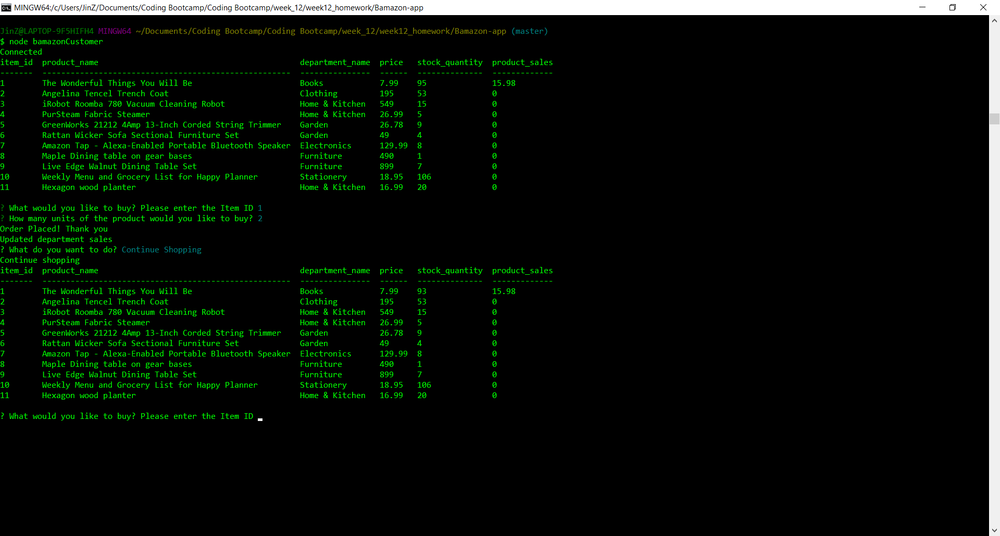
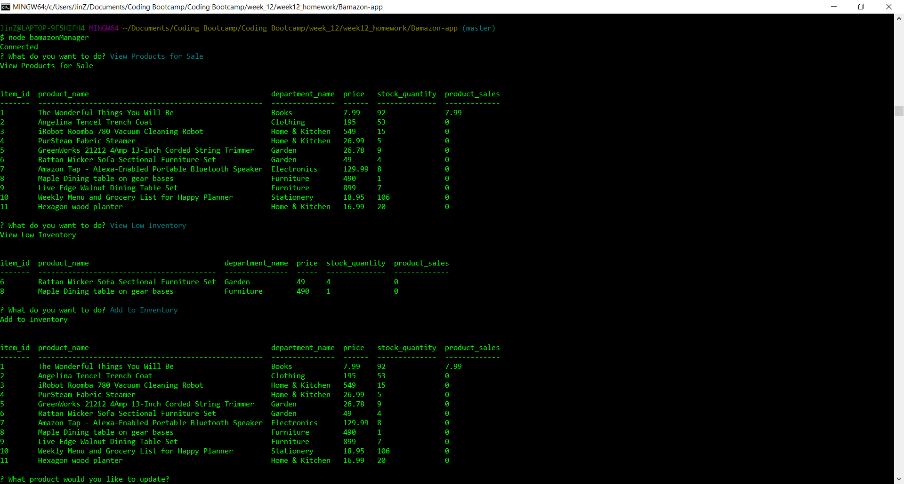
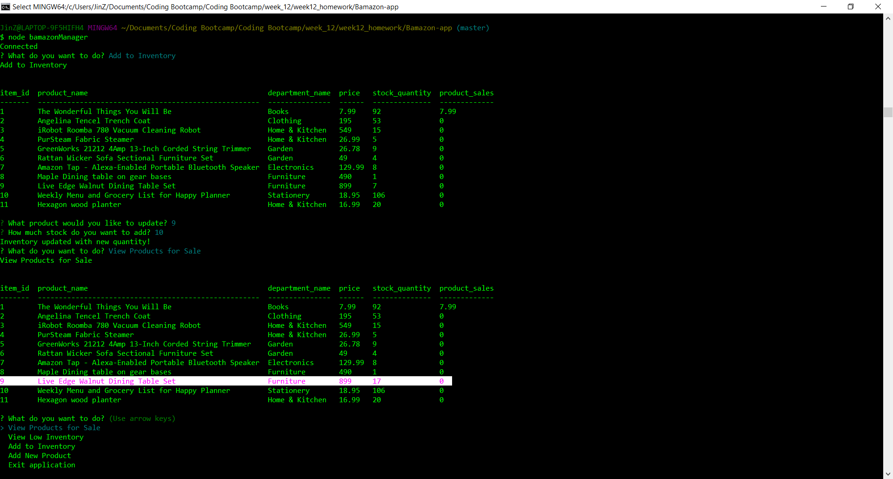
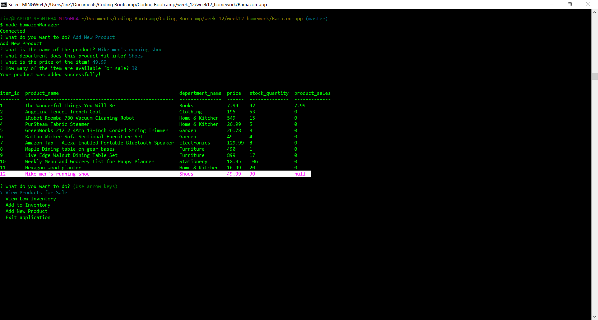
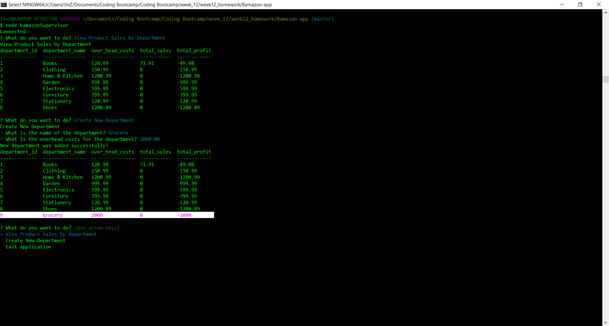

# Bamazon-app
An Amazon-like storefront app using MySQL database and Nodejs

## Technologies used
You can give a brief listing of the technologies you've learned and applied here
- node.js
- MySQL

## Getting Started


### Prerequisities

What to install and how for local development and testing purposes

```
- node.js: visit node.js and download..
- mysqldb: brew install mysql
```

## Features

Customer view


Manager View




Supervisor View


## Authors

* **Jincy George** - *Initial work* - [Jincy George](https://github.com)


## License

This project is licensed under the MIT License - see the [LICENSE.md](LICENSE.md) file for details
